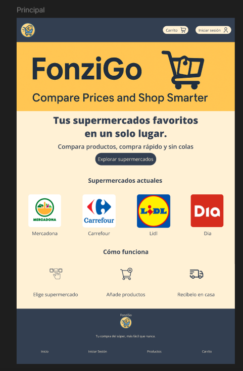
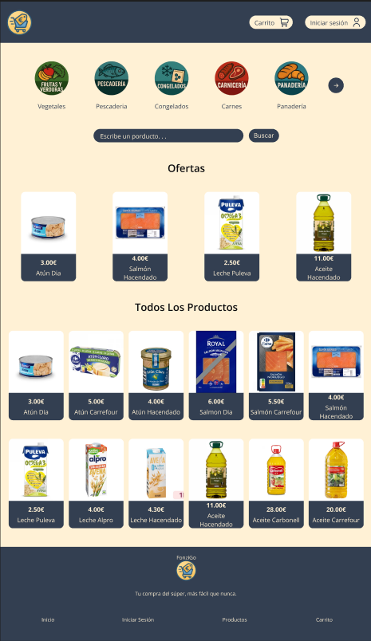
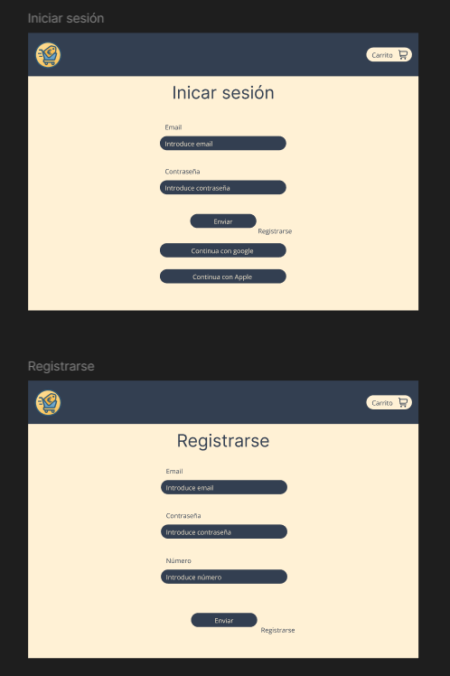
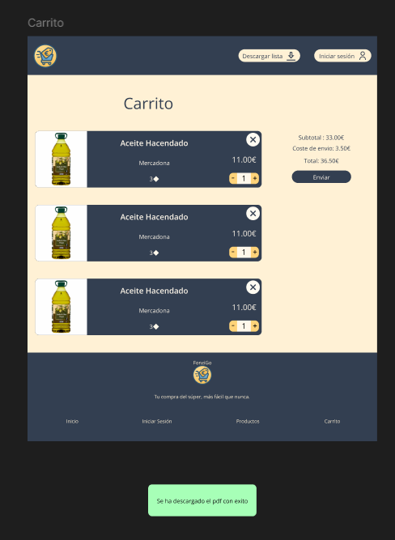

# Documentación de Diseño y Arquitectura CSS - FonziGo

## Sistema de Diseño Completo con ITCSS + BEM + Angular

**Proyecto:** FonziGo  

---

## Tabla de Contenidos

1. [Arquitectura CSS y Comunicación Visual](#1-arquitectura-css-y-comunicación-visual)
2. [HTML Semántico y Estructura](#2-html-semántico-y-estructura)
3. [Sistema de Componentes UI](#3-sistema-de-componentes-ui)

---

# 1. Arquitectura CSS y Comunicación Visual

## 1.1 Principios de Comunicación Visual

He aplicado los 5 principios fundamentales del diseño visual en todo el proyecto. A continuación explico cada uno mostrando:
- Cómo lo diseñé en **Figma** (mockup)
- Cómo lo implementé en **Angular**
- **Justificación** de los cambios realizados

---

### Jerarquía

La jerarquía visual guía al usuario por el contenido en orden de importancia.

**Diseño en Figma:**



En el mockup de Figma diseñé la jerarquía así:
1. **Logo "FonziGo"** - El elemento más grande y prominente
2. **Subtítulo "Compare Prices and Shop Smarter"** - Tamaño menor
3. **Slogan** - "Tus supermercados favoritos en un solo lugar"
4. **Secciones** - "Supermercados actuales" y "Cómo funciona"

**Implementación en Angular:**

En la implementación real mantuve la misma jerarquía pero con ajustes técnicos:

```sass
// Escala tipográfica implementada en _variables.sass
--text-xs: 0.8rem      // Texto auxiliar
--text-base: 1rem      // Texto normal
--text-xl: 1.25rem     // Subtítulos
--text-3xl: 1.953rem   // Títulos de sección
--text-5xl: 3.052rem   // Título principal
```

**Cambios y justificación:**

| Figma | Angular | Justificación |
|-------|---------|---------------|
| Tamaños fijos en px | Variables CSS con rem | Mejor accesibilidad y escalabilidad responsive |
| Tipografía genérica | Open Sans + Montserrat | Open Sans mejora legibilidad en pantalla, Montserrat da personalidad a títulos |
| 5 niveles de tamaño | 9 niveles (xs a 5xl) | Mayor flexibilidad para diferentes contextos |

---

### Contraste

El contraste diferencia elementos y mejora la legibilidad.

**Diseño en Figma:**



En Figma diseñé el contraste con:
- Header azul oscuro vs fondo amarillo claro
- Precios destacados en amarillo sobre cards
- Botón "Buscar" amarillo sobre input oscuro

**Implementación en Angular:**

Mantuve los mismos colores pero los organicé en design tokens:

```sass
// Colores implementados en _variables.sass
--primary-blue: #333F51        // Header, textos
--primary-blue-alt: #576C8A    // Textos secundarios
--secundary-yellow: #FFF1D5    // Fondo claro
--secundary-yellow-alt: #FFD379 // Botones, precios
--background: #FEFEFE          // Fondo de cards
```

**Cambios y justificación:**

| Figma | Angular | Justificación |
|-------|---------|---------------|
| Fondo cards #FFFFFF | Fondo cards #FEFEFE | El blanco puro (#FFF) resulta demasiado brillante y cansa la vista. El #FEFEFE es casi blanco pero más suave |
| Colores hardcodeados | CSS Custom Properties | Permite cambiar toda la paleta desde un solo archivo, facilita mantenimiento y futura implementación de dark mode |
| Sin estados hover | Estados hover con cambio de color | Mejora la experiencia de usuario indicando elementos interactivos |

---

### Alineación

La alineación crea orden y conexión visual entre elementos.

**Diseño en Figma:**



En Figma diseñé los formularios con:
- Título centrado
- Labels alineados a la izquierda
- Inputs con ancho completo
- Botones centrados

**Implementación en Angular:**

```sass
// Implementación en login.sass
.login
  max-width: 550px
  margin-inline: auto        // Centrado horizontal
  display: flex
  flex-direction: column
  
  &__fieldset
    display: flex
    flex-direction: column   // Alineación vertical
    gap: var(--spacing-4)    // Espaciado consistente
```

**Cambios y justificación:**

| Figma | Angular | Justificación |
|-------|---------|---------------|
| Ancho fijo 400px | max-width: 550px | 550px permite inputs más cómodos de usar en desktop sin perder la sensación de formulario compacto |
| Sin fieldset | Con `<fieldset>` y `<legend>` | HTML semántico mejora accesibilidad para lectores de pantalla |
| Alineación con margins | Flexbox con gap | Más mantenible y consistente que calcular margins individuales |
| Botones sociales en fila | Botones sociales responsivos | En móvil se apilan verticalmente para mejor usabilidad |

---

### Proximidad

La proximidad agrupa elementos relacionados.

**Diseño en Figma:**



En Figma agrupé:
- Cada producto en su propia card (imagen + info + controles)
- Resumen de compra separado a la derecha
- Footer claramente separado

**Implementación en Angular:**

```sass
// Sistema de espaciado en _variables.sass
--spacing-2: 0.5rem    // 8px - Entre icono y texto
--spacing-4: 1rem      // 16px - Entre campos relacionados
--spacing-6: 1.5rem    // 24px - Entre grupos
--spacing-8: 2rem      // 32px - Entre secciones
--spacing-12: 3rem     // 48px - Entre secciones principales
```

**Cambios y justificación:**

| Figma | Angular | Justificación |
|-------|---------|---------------|
| Espaciados arbitrarios (15px, 22px...) | Sistema basado en 4px (8, 12, 16, 24...) | Un sistema de espaciado consistente crea ritmo visual y es más fácil de mantener |
| Cards pegadas al borde | Cards con padding interno | Mejor respiración visual y área de click más grande en móvil |
| Resumen fijo a la derecha | Resumen responsive | En móvil el resumen aparece después de los productos, no al lado |

---

### Repetición

La repetición crea coherencia visual en toda la aplicación.

**Diseño en Figma:**

En todos los mockups mantuve consistencia en:
- Header azul idéntico
- Footer con misma estructura
- Cards de producto con mismo diseño
- Botones amarillos iguales

**Implementación en Angular:**

Creé componentes reutilizables para garantizar repetición:

```typescript
// Componentes implementados
app-button      // Un solo componente para TODOS los botones
app-form-input  // Un solo componente para TODOS los inputs
app-alert       // Un solo componente para TODAS las alertas
app-header      // Header compartido en todas las páginas
app-footer      // Footer compartido en todas las páginas
```

**Cambios y justificación:**

| Figma | Angular | Justificación |
|-------|---------|---------------|
| Diseños copiados manualmente | Componentes reutilizables | Si cambio el estilo del botón, cambia en TODA la app automáticamente |
| Border-radius variado (4px, 8px, 10px) | Border-radius estandarizado (4px, 8px) | Reducir variaciones innecesarias mejora la coherencia visual |
| Sin sistema de diseño | ITCSS + BEM | Arquitectura CSS escalable que facilita mantenimiento |
| Sin transiciones | Transiciones 300ms | Añade feedback visual sin afectar rendimiento |

---

### Resumen de Cambios Figma → Angular

| Aspecto | Mejora Implementada |
|---------|---------------------|
| **Colores** | Design tokens en CSS Custom Properties |
| **Tipografía** | Escala modular con variables |
| **Espaciado** | Sistema basado en múltiplos de 4px |
| **Componentes** | Arquitectura de componentes reutilizables |
| **Accesibilidad** | HTML semántico, ARIA, contraste AAA |
| **Responsive** | Mobile-first con breakpoints definidos |
| **Mantenibilidad** | ITCSS + BEM + Standalone Components |

---

## 1.2 Metodología CSS: BEM

He elegido BEM (Block Element Modifier) por su claridad y escalabilidad.

### Estructura

```
.block           → Componente independiente
.block__element  → Parte del bloque
.block--modifier → Variante del bloque
```

### Ejemplos Reales del Proyecto

```sass
// Componente Button
.btn                    // Block: el botón completo
  &__content           // Element: contenido del botón
  &__spinner           // Element: indicador de carga
  &__icon              // Element: icono
  &--primary           // Modifier: variante primaria
  &--secondary         // Modifier: variante secundaria
  &--sm                // Modifier: tamaño pequeño
  &--lg                // Modifier: tamaño grande

// Componente Form Input
.form-input            // Block
  &__label            // Element: etiqueta
  &__control          // Element: campo de entrada
  &__help             // Element: texto de ayuda
  &__error            // Element: mensaje de error
  &__required         // Element: indicador de requerido
  &--error            // Modifier: estado de error
  &--disabled         // Modifier: estado deshabilitado

// Componente Alert
.alert                 // Block
  &__content          // Element: contenido
  &__close            // Element: botón cerrar
  &--success          // Modifier: tipo éxito
  &--error            // Modifier: tipo error
  &--warning          // Modifier: tipo advertencia
  &--info             // Modifier: tipo información
```

### Ventajas de BEM

1. **Especificidad baja:** Todos los selectores tienen la misma especificidad
2. **Autodocumentado:** El nombre indica la relación entre elementos
3. **Sin conflictos:** No hay colisiones de nombres entre componentes
4. **Fácil de mantener:** Cambios en un bloque no afectan a otros

---

## 1.3 Organización de Archivos: ITCSS

ITCSS (Inverted Triangle CSS) organiza los estilos de menor a mayor especificidad.

### Estructura del Proyecto

```
frontend/src/styles/
├── 00-settings/       → Variables y design tokens
│   └── _variables.sass
├── 01-tools/          → Mixins y funciones
│   └── _mixins.sass
├── 02-generic/        → Reset y normalización
│   └── _reset.sass
├── 03-elements/       → Estilos base HTML (sin clases)
│   └── _base.sass
├── 04-layout/         → Sistema de grid y contenedores
│   └── _layout.sass
├── 05-components/     → Componentes UI específicos
│   ├── _buttons.sass
│   ├── _header.sass
│   └── _footer.sass
├── 06-utilities/      → Clases de ayuda
│   └── _helpers.sass
└── styles.sass        → Punto de entrada (importa todo)
```

### Orden de Importación

```sass
// styles.sass - El orden es CRÍTICO
@use '00-settings/variables'
@use '01-tools/mixins'
@use '02-generic/reset'
@use '03-elements/base'
@use '04-layout/layout'
@use '05-components/buttons'
@use '05-components/header'
@use '05-components/footer'
@use '06-utilities/helpers'
```

### Por qué este orden

1. **Settings:** Variables disponibles para todo lo demás
2. **Tools:** Mixins que usan las variables
3. **Generic:** Reset sin clases, especificidad mínima
4. **Elements:** Estilos de elementos HTML
5. **Layout:** Estructuras de página
6. **Components:** Componentes específicos con clases BEM
7. **Utilities:** Clases de ayuda con !important si es necesario

---

## 1.4 Sistema de Design Tokens

Los design tokens son la única fuente de verdad para valores visuales.

### Colores

```sass
// Colores Primarios - Azul corporativo
--primary: #3b82f6
--primary-hover: #2563eb
--primary-light: #dbeafe
--primary-dark: #1d4ed8

// Colores Secundarios - Amarillo/Naranja
--secondary: #f59e0b
--secondary-hover: #d97706
--secondary-light: #fef3c7

// Colores Semánticos
--success: #10b981      // Verde - confirmaciones
--error: #ef4444        // Rojo - errores
--warning: #f59e0b      // Naranja - advertencias
--info: #3b82f6         // Azul - información

// Colores de Interfaz
--bg-primary: #ffffff   // Fondo principal
--bg-secondary: #f5f7fa // Fondo secundario
--text-primary: #1a1a2e // Texto principal
--text-secondary: #4a4a68 // Texto secundario
--border-color: #d1d5db // Bordes
```

**Decisiones:**
- Azul primario transmite confianza y profesionalidad
- Amarillo secundario aporta calidez y atención
- Colores semánticos siguen convenciones universales

### Tipografía

```sass
// Familias
--font-primary: 'Open Sans', sans-serif   // Lectura
--font-secondary: 'Montserrat', sans-serif // Títulos

// Escala Modular (ratio 1.25)
--text-xs: 0.8rem      // 12.8px
--text-sm: 0.9rem      // 14.4px
--text-base: 1rem      // 16px
--text-lg: 1.125rem    // 18px
--text-xl: 1.25rem     // 20px
--text-2xl: 1.563rem   // 25px
--text-3xl: 1.953rem   // 31.25px
--text-4xl: 2.441rem   // 39px
--text-5xl: 3.052rem   // 48.8px

// Pesos
--font-light: 300
--font-regular: 400
--font-medium: 500
--font-semibold: 600
--font-bold: 700

// Alturas de línea
--line-height-tight: 1.2    // Títulos
--line-height-normal: 1.5   // Texto general
--line-height-relaxed: 1.8  // Texto largo
```

**Decisiones:**
- Open Sans para legibilidad en textos largos
- Montserrat para títulos con personalidad
- Escala modular para armonía visual

### Espaciado

```sass
// Sistema basado en 4px (0.25rem)
--spacing-1: 0.25rem   // 4px
--spacing-2: 0.5rem    // 8px
--spacing-3: 0.75rem   // 12px
--spacing-4: 1rem      // 16px
--spacing-5: 1.25rem   // 20px
--spacing-6: 1.5rem    // 24px
--spacing-8: 2rem      // 32px
--spacing-10: 2.5rem   // 40px
--spacing-12: 3rem     // 48px
--spacing-16: 4rem     // 64px
--spacing-20: 5rem     // 80px
--spacing-24: 6rem     // 96px
```

**Decisiones:**
- Base de 4px para alineación con grids de diseño
- Valores predefinidos evitan números arbitrarios

### Breakpoints

```sass
$breakpoint-sm: 640px   // Móvil grande
$breakpoint-md: 768px   // Tablet
$breakpoint-lg: 1024px  // Desktop
$breakpoint-xl: 1280px  // Desktop grande
$breakpoint-2xl: 1536px // Pantallas extra grandes
```

**Decisiones:**
- 640px captura la mayoría de móviles en landscape
- 768px coincide con iPad en portrait
- 1024px es el punto típico de cambio a desktop

### Elevaciones (Sombras)

```sass
--shadow-sm: 0 1px 2px 0 rgba(0, 0, 0, 0.05)
--shadow-md: 0 4px 6px -1px rgba(0, 0, 0, 0.1), 0 2px 4px -1px rgba(0, 0, 0, 0.06)
--shadow-lg: 0 10px 15px -3px rgba(0, 0, 0, 0.1), 0 4px 6px -2px rgba(0, 0, 0, 0.05)
--shadow-xl: 0 20px 25px -5px rgba(0, 0, 0, 0.1), 0 10px 10px -5px rgba(0, 0, 0, 0.04)
```

### Bordes

```sass
// Grosor
--border-thin: 1px
--border-medium: 2px
--border-thick: 4px

// Radios
--radius-sm: 0.125rem  // 2px - Elementos pequeños
--radius-md: 0.25rem   // 4px - Botones, inputs
--radius-lg: 0.5rem    // 8px - Cards
--radius-xl: 0.75rem   // 12px - Modales
--radius-full: 9999px  // Círculos
```

### Transiciones

```sass
--transition-fast: 150ms ease-in-out   // Hovers rápidos
--transition-base: 300ms ease-in-out   // Transiciones normales
--transition-slow: 500ms ease-in-out   // Animaciones complejas
```

---

## 1.5 Mixins y Funciones

### Mixin: Responsive Breakpoints

```sass
// Uso
.mi-elemento
  font-size: 1rem
  +media-breakpoint-up(md)
    font-size: 1.25rem
  +media-breakpoint-up(lg)
    font-size: 1.5rem
```

### Mixin: Flex Center

```sass
// Definición
=flex-center
  display: flex
  justify-content: center
  align-items: center

// Uso
.modal__overlay
  +flex-center
```

### Mixin: Smooth Transition

```sass
// Definición
=smooth-transition($properties...)
  @if length($properties) == 0
    transition: all var(--transition-base)
  @else
    $transitions: ()
    @each $prop in $properties
      $transitions: append($transitions, $prop var(--transition-base), comma)
    transition: $transitions

// Uso
.btn
  +smooth-transition(background-color, transform, box-shadow)
```

### Mixin: Hover Lift

```sass
// Definición
=hover-lift($distance: -2px, $shadow: true)
  +smooth-transition(transform, box-shadow)
  &:hover
    transform: translateY($distance)
    @if $shadow
      box-shadow: var(--shadow-lg)

// Uso
.card
  +hover-lift
```

### Mixin: Container

```sass
// Definición
=container($max-width: $breakpoint-lg)
  width: 100%
  max-width: $max-width
  margin-left: auto
  margin-right: auto
  padding-left: var(--spacing-4)
  padding-right: var(--spacing-4)

// Uso
.header__container
  +container
```

### Mixin: Button Base

```sass
// Definición
=button-base
  display: inline-flex
  align-items: center
  justify-content: center
  gap: var(--spacing-2)
  font-family: var(--font-secondary)
  font-weight: var(--font-semibold)
  border-radius: var(--radius-md)
  cursor: pointer
  +smooth-transition(background-color, color, transform, box-shadow)
  
  &:disabled
    opacity: 0.6
    cursor: not-allowed

// Uso
.btn
  +button-base
```

---

## 1.6 ViewEncapsulation en Angular

### Estrategia Implementada

He utilizado una estrategia mixta de encapsulación:

**ViewEncapsulation.None** para:
- Header
- Footer
- Main

**ViewEncapsulation.Emulated** (default) para:
- Todos los demás componentes

### Justificación

```typescript
// Header - Sin encapsulación
@Component({
  selector: 'app-header',
  encapsulation: ViewEncapsulation.None // Estilos globales
})
```

**Por qué None para layout:**
- Los componentes de layout necesitan consistencia global
- Sus estilos viven en `05-components/_header.sass`
- Evita duplicación de estilos

**Por qué Emulated para componentes:**
- Cada componente es independiente
- No hay conflictos de nombres
- Facilita la reutilización

---

# 2. HTML Semántico y Estructura

## 2.1 Elementos Semánticos Utilizados

### `<header>`

```html
<header class="header">
  <nav aria-label="Navegación principal">
    <!-- Logo, menú, acciones -->
  </nav>
</header>
```

**Cuándo usarlo:** Cabecera de página o sección.

### `<main>`

```html
<main class="main" role="main">
  <ng-content></ng-content>
</main>
```

**Cuándo usarlo:** Contenido principal de la página. Solo uno por página.

### `<footer>`

```html
<footer class="footer">
  <p>&copy; 2024 FonziGo. Todos los derechos reservados.</p>
</footer>
```

**Cuándo usarlo:** Pie de página o sección.

### `<nav>`

```html
<nav class="header__nav" aria-label="Navegación de autenticación">
  <a routerLink="/login">Iniciar sesión</a>
  <a routerLink="/register">Registrarse</a>
</nav>
```

**Cuándo usarlo:** Grupos de enlaces de navegación.

### `<section>`

```html
<section class="style-guide__section" id="buttons">
  <h2>Botones</h2>
  <!-- Contenido de la sección -->
</section>
```

**Cuándo usarlo:** Secciones temáticas del contenido.

---

## 2.2 Jerarquía de Headings

### Reglas Implementadas

1. **Solo un `<h1>` por página**
2. **Nunca saltar niveles** (h1 → h2 → h3, no h1 → h3)
3. **Orden lógico y descriptivo**

### Ejemplo de Jerarquía

```
H1: FonziGo - Tienda Online
├── H2: Productos Destacados
│   ├── H3: Categoría Electrónica
│   └── H3: Categoría Hogar
├── H2: Ofertas Especiales
└── H2: Testimonios de Clientes
```

### Implementación en Style Guide

```html
<h1 class="style-guide__title">Style Guide</h1>

<section id="buttons">
  <h2 class="style-guide__section-title">Botones</h2>
  <h3 class="style-guide__subsection-title">Variantes</h3>
  <h3 class="style-guide__subsection-title">Tamaños</h3>
</section>

<section id="forms">
  <h2 class="style-guide__section-title">Formularios</h2>
  <h3 class="style-guide__subsection-title">Input de Texto</h3>
  <h3 class="style-guide__subsection-title">Select</h3>
</section>
```

---

## 2.3 Estructura de Formularios

### Asociación Label-Input

Todo input debe tener un label asociado mediante `for` e `id`:

```html
<label class="form-input__label" [for]="id">
  {{ label }}
  @if (required) {
    <span class="form-input__required" aria-label="requerido">*</span>
  }
</label>

<input
  class="form-input__control"
  [id]="id"
  [type]="type"
  [attr.aria-required]="required ? 'true' : null"
  [attr.aria-invalid]="errorText ? 'true' : null"
  [attr.aria-describedby]="(helpText || errorText) ? id + '-description' : null"
/>
```

### Fieldset y Legend

```html
<form>
  <fieldset>
    <legend>Datos de acceso</legend>
    <app-form-input id="email" label="Email" type="email" [required]="true" />
    <app-form-input id="password" label="Contraseña" type="password" [required]="true" />
  </fieldset>
  
  <button type="submit">Iniciar sesión</button>
</form>
```

### Atributos ARIA para Accesibilidad

| Atributo | Propósito |
|----------|-----------|
| `aria-required="true"` | Indica campo obligatorio |
| `aria-invalid="true"` | Indica campo con error |
| `aria-describedby` | Vincula mensaje de ayuda/error |
| `role="alert"` | Anuncia errores a lectores de pantalla |

### Componente Form Input Completo

```html
<div class="form-input" 
     [class.form-input--error]="errorText" 
     [class.form-input--disabled]="disabled">
  
  <label class="form-input__label" [for]="id">
    {{ label }}
    @if (required) {
      <span class="form-input__required" aria-label="requerido">*</span>
    }
  </label>

  <input
    class="form-input__control"
    [id]="id"
    [type]="type"
    [name]="name || id"
    [placeholder]="placeholder"
    [required]="required"
    [disabled]="disabled"
    [attr.aria-required]="required ? 'true' : null"
    [attr.aria-invalid]="errorText ? 'true' : null"
    [attr.aria-describedby]="(helpText || errorText) ? id + '-description' : null"
  />

  @if (helpText && !errorText) {
    <p [id]="id + '-description'" class="form-input__help">
      {{ helpText }}
    </p>
  }

  @if (errorText) {
    <p [id]="id + '-description'" class="form-input__error" role="alert">
      {{ errorText }}
    </p>
  }
</div>
```

---

# 3. Sistema de Componentes UI

## 3.1 Componentes Implementados

### Button (`app-button`)

**Propósito:** Botón reutilizable con múltiples variantes y estados.

**Variantes:**
- `primary` - Acción principal
- `secondary` - Acción secundaria
- `outline` - Borde sin fondo
- `ghost` - Sin fondo ni borde
- `danger` - Acciones destructivas

**Tamaños:**
- `sm` - 32px altura
- `md` - 40px altura (default)
- `lg` - 48px altura

**Estados:**
- Normal
- Hover (elevación)
- Focus (outline visible)
- Active (pressed)
- Disabled (opacity 0.6)
- Loading (spinner)

**Ejemplo de uso:**

```html
<app-button variant="primary" size="md" [loading]="isLoading">
  Guardar cambios
</app-button>
```

### Alert (`app-alert`)

**Propósito:** Mensajes de feedback para el usuario.

**Tipos:**
- `success` - Verde, confirmaciones
- `error` - Rojo, errores
- `warning` - Naranja, advertencias
- `info` - Azul, información

**Propiedades:**
- `type` - Tipo de alerta
- `closeable` - Mostrar botón X

**Ejemplo de uso:**

```html
<app-alert type="success" [closeable]="true">
  ¡Operación completada con éxito!
</app-alert>
```

### Form Input (`app-form-input`)

**Propósito:** Campo de entrada de texto accesible.

**Propiedades:**
- `id` - Identificador único
- `label` - Etiqueta del campo
- `type` - Tipo de input (text, email, password...)
- `placeholder` - Texto de ayuda
- `required` - Campo obligatorio
- `disabled` - Campo deshabilitado
- `helpText` - Texto de ayuda
- `errorText` - Mensaje de error

**Ejemplo de uso:**

```html
<app-form-input
  id="email"
  label="Correo electrónico"
  type="email"
  placeholder="tu@email.com"
  [required]="true"
  helpText="Usaremos este email para contactarte"
  [errorText]="emailError"
/>
```

### Form Select (`app-form-select`)

**Propósito:** Selector desplegable accesible.

**Propiedades:**
- `id`, `label`, `required`, `disabled`, `helpText`, `errorText`
- `options` - Array de opciones {value, label, disabled?}
- `placeholder` - Texto cuando no hay selección

**Ejemplo de uso:**

```html
<app-form-select
  id="provincia"
  label="Provincia"
  [options]="provincias"
  placeholder="Selecciona una provincia"
  [required]="true"
/>
```

### Form Textarea (`app-form-textarea`)

**Propósito:** Área de texto multilínea accesible.

**Propiedades adicionales:**
- `rows` - Número de filas visibles
- `maxLength` - Límite de caracteres
- `resize` - Control de redimensionado (none, vertical, horizontal, both)

**Ejemplo de uso:**

```html
<app-form-textarea
  id="mensaje"
  label="Tu mensaje"
  [rows]="5"
  [maxLength]="500"
  resize="vertical"
  [required]="true"
/>
```

### Product Card (`app-product-card`)

**Propósito:** Tarjeta de producto para catálogos.

**Propiedades:**
- `product` - Objeto con datos del producto
- Imagen, título, descripción, precio
- Hover con elevación

---

## 3.2 Nomenclatura BEM Aplicada

### Ejemplo: Componente Button

```sass
.btn                          // Block
  display: inline-flex
  
  &__content                  // Element: contenido
    display: flex
    align-items: center
    
  &__spinner                  // Element: loading spinner
    animation: spin 1s linear infinite
    
  &__icon                     // Element: icono
    &--left                   // Modifier del element
      margin-right: var(--spacing-2)
    &--right
      margin-left: var(--spacing-2)
      
  &--primary                  // Modifier: variante
    background-color: var(--primary)
    color: white
    
  &--secondary
    background-color: var(--secondary)
    
  &--sm                       // Modifier: tamaño
    height: 32px
    padding: 0 var(--spacing-3)
    font-size: var(--text-sm)
    
  &--lg
    height: 48px
    padding: 0 var(--spacing-6)
    font-size: var(--text-lg)
```

### Cuándo usar Element vs Modifier

**Element (`__`):** Parte estructural del bloque
- `.btn__icon` - El icono es parte del botón
- `.form-input__label` - El label es parte del input

**Modifier (`--`):** Variante o estado
- `.btn--primary` - Variante de estilo
- `.btn--disabled` - Estado
- `.btn--lg` - Variante de tamaño

---

## 3.3 Style Guide

El Style Guide está disponible en `/style-guide` y muestra:

### Secciones Incluidas

1. **Botones**
   - Todas las variantes (primary, secondary, outline, ghost, danger)
   - Todos los tamaños (sm, md, lg)
   - Todos los estados (normal, disabled, loading)
   - Full width

2. **Alertas**
   - Todos los tipos (success, error, warning, info)
   - Con y sin botón de cerrar

3. **Formularios**
   - Input de texto (normal, con error, deshabilitado)
   - Select
   - Textarea con contador
   - Formulario completo

### Propósito del Style Guide

1. **Documentación visual:** Ver todos los componentes de un vistazo
2. **Testing rápido:** Verificar que todo funciona correctamente
3. **Referencia para desarrollo:** Copiar código de ejemplo
4. **Consistencia:** Asegurar que todos los componentes siguen el mismo estilo

---

## Buenas Prácticas Implementadas

### Sintaxis Moderna de Angular 17+

Se utiliza la nueva sintaxis de control de flujo:

```html
<!-- Antes (obsoleto) -->
<span *ngIf="required">*</span>
<option *ngFor="let option of options">...</option>

<!-- Ahora (moderno) -->
@if (required) {
  <span>*</span>
}

@for (option of options; track option.value) {
  <option>...</option>
}
```

### Ventajas de @if/@for

1. **Mejor rendimiento:** Compilación más eficiente
2. **Sintaxis más clara:** Similar a otros lenguajes
3. **Soporte nativo para @else:** Sin necesidad de ng-template
4. **Track obligatorio:** Fuerza buenas prácticas en listas

---

## Conclusión

Este sistema de diseño proporciona:

- ✅ Arquitectura ITCSS escalable
- ✅ Design tokens como fuente única de verdad
- ✅ Metodología BEM consistente
- ✅ Mixins reutilizables
- ✅ HTML semántico con ARIA
- ✅ Componentes accesibles WCAG AA
- ✅ Sintaxis moderna de Angular
- ✅ Style Guide como documentación visual

---

# Anexo: Mockups de Figma

A continuación se muestran todos los mockups diseñados en Figma que sirvieron como base para la implementación en Angular.

## Página Principal (Home)


**Descripción:** Landing page con el logo de FonziGo, slogan, supermercados disponibles y sección "Cómo funciona".

---

## Página de Productos


**Descripción:** Catálogo de productos con categorías, barra de búsqueda, sección de ofertas y grid de todos los productos.

---

## Formulario de Inicio de Sesión


**Descripción:** Formulario de inicio de sesión con campos de email y contraseña, botón de enviar y opciones de login social (Google, Apple).

---

## Página del Carrito


**Descripción:** Vista del carrito de compras con lista de productos, controles de cantidad, resumen de compra (subtotal, envío, total) y toast de confirmación de descarga PDF.
